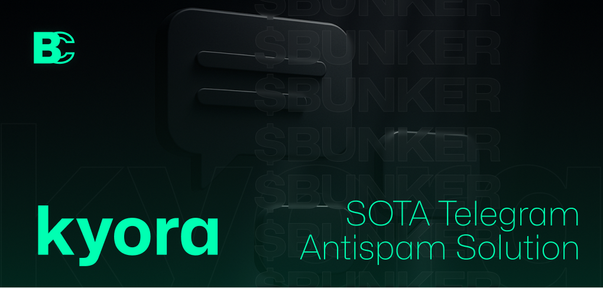

# kyora




Advanced anti-spam bot for Telegram, by BunkerCoin.

## Why Kyora

Current Telegram anti-spam bots fail to address modern spam tactics. Kyora fills this gap and aims to surpass all existing solutions.

## Features

### Current
- Detects and deletes messages quoting external channels (no bot does that right now for some reason)
- Optional file logging for analysis (disabled by default)
- Zero configuration required

### Roadmap
- Custom portal with advanced captcha verification
- Vector DB & LLM integration for self-improving detection
- Community raiding support
- LLM finetuning on spam

## Installation

```bash
git clone https://github.com/TheBunkerCoin/kyora.git
cd kyora
bun install
echo "BOT_TOKEN=your_telegram_bot_token" > .env
```

## Running

```bash
# Default: console logs only
bun start

# With file logging enabled
bun start --log-files
```

## Usage

When file logging is enabled (--log-files):
```bash
bun view-logs          # All messages
bun view-logs --spam   # Deleted spam
```

## Requirements

Bot needs:
- Delete messages permission
- Read messages permission
- Admin privileges in channels

##